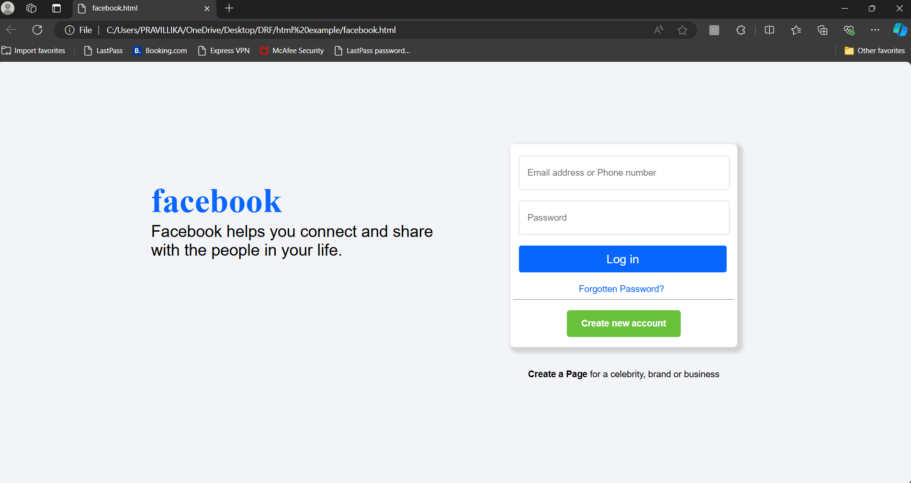

# Facebook Login Page Clone
HII !!! this is Pravallika i have created a facebook login page by using simple lines of html,css code...

This project is a simple clone of the Facebook login page, built using HTML and CSS. It demonstrates how to create a clean and responsive login page interface similar to Facebook's.

## Features

- Responsive design
- Styled using pure CSS
- Simple and clean layout similar to Facebook’s login page

## Technologies Used

- HTML
- CSS

## Preview



## How to Ruo

1. Clone the repository to your local machine:
    ```bash
    git clone https://github.com/your-username/facebook-login-clone.git
    ```

2. Navigate to the project directory:
    ```bash
    cd facebook-login-clone
    ```

3. Open `index.html` in your browser to view the login page.

## Skills Demonstrated

- **HTML**: Structure of the web page
- **CSS**: Styling and layout

## Future Enhancements

- Add form validation using JavaScript
- Improve accessibility features
- Add a backend to handle login functionality (e.g., using SQL and Java)

## Author

**Pravallika**  
Skills: Java, SQL, HTML, CSS

Feel free to reach out if you have any questions or suggestions!

